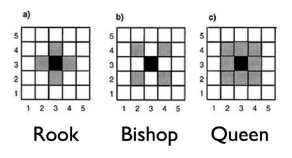

```{r, include=FALSE}
library(dplyr)
library(readr)
library(stringr)
library(tidyverse)
library(tidycensus)
library(tigris)
library(ggplot2)
library(sf)
library(spatialreg)
library(spdep)
library(splines)
library(ggpubr)
```

# Analysis

As we begin the analysis portion or our project, we asked ourselves, what factors always have influence in national elections? Of course, the amount of people that are registered and the amount of people that go to the polls that are registered play a big part. We also wanted to compare across major ethnicities in Texas, rural vs. urban, and income disparity in the state. We felt that these three factors in addition to registration and turnout would allow us to be able to get a good cross-section of the 2016 election in Texas.

## Linearity

The first part of our modeling process was to look at a linear model with our variables to see what the residuals would look like and to test if all of our variables have linearity. The variable that we are attempting to model results around is the vote difference which is a variable that is on a scale from -1 to 1, 1 being a county voted 100% for Trump and -1 being 100% voted for Clinton. The variables that we used to try and predict the vote difference are the proportion of Hispanic, White, Black and Foreign-born voters, the voter turnout deficit, and each county's per-capita income. 


```{r, echo=FALSE, warning=FALSE, message=FALSE}
g1 <- txwinning %>%
  ggplot(aes(y = vote_diff_RD, x = deficit))+
  geom_point() +
  geom_smooth(se=FALSE, color = "gray") +
  theme_classic() +
  theme(axis.title.x=element_blank(),
        axis.text.x=element_blank(),
        axis.ticks.x=element_blank(),
        axis.text.y=element_blank(),
        axis.ticks.y=element_blank()) +
  ggtitle("Deficit") +
  labs(y="Vote Difference (% R - % D)")

g2<- txwinning %>%
  ggplot(aes(y = vote_diff_RD, x = hispanic))+
  geom_point() +
  geom_smooth(se=FALSE, color = "gray") +
  theme_classic() +
  theme(axis.title.x=element_blank(),
        axis.text.x=element_blank(),
        axis.ticks.x=element_blank(),
        axis.text.y=element_blank(),
        axis.ticks.y=element_blank()) +
  ggtitle("% of Hispanic Population") +
  labs(y="Vote Difference (% R - % D)")

g3<- txwinning %>%
  ggplot(aes(y = vote_diff_RD, x = white))+
  geom_point() +
  geom_smooth(se=FALSE, color = "gray") +
  theme_classic() +
  theme(axis.title.x=element_blank(),
        axis.text.x=element_blank(),
        axis.ticks.x=element_blank(),
        axis.text.y=element_blank(),
        axis.ticks.y=element_blank()) +
  ggtitle("% of White Population") +
  labs(y="Vote Difference (% R - % D)")

g4<- txwinning %>%
  ggplot(aes(y = vote_diff_RD, x = black))+
  geom_point() +
  geom_smooth(se=FALSE, color = "gray") +
  theme_classic() +
  theme(axis.title.x=element_blank(),
        axis.text.x=element_blank(),
        axis.ticks.x=element_blank(),
        axis.text.y=element_blank(),
        axis.ticks.y=element_blank()) +
  ggtitle("% of Black Population") +
  labs(y="Vote Difference (% R - % D)")

g5<- txwinning %>%
  ggplot(aes(y = vote_diff_RD, x = foreign))+
  geom_point() +
  geom_smooth(se=FALSE, color = "gray") +
  theme_classic() +
  theme(axis.title.x=element_blank(),
        axis.text.x=element_blank(),
        axis.ticks.x=element_blank(),
        axis.text.y=element_blank(),
        axis.ticks.y=element_blank()) +
  ggtitle("% of Foreign Born Population") +
  labs(y="Vote Difference (% R - % D)")

g6<- txwinning %>%
  ggplot(aes(y = vote_diff_RD, x = per_capita_income))+
  geom_point() +
  geom_smooth(se=FALSE, color = "gray") +
  theme_classic() +
  theme(axis.title.x=element_blank(),
        axis.text.x=element_blank(),
        axis.ticks.x=element_blank(),
        axis.text.y=element_blank(),
        axis.ticks.y=element_blank()) +
  ggtitle("Per-capita Income") +
  labs(y="Vote Difference (% R - % D)")

ggarrange(g1, g2, g3, g4, g5, g6)
```

After producing our preliminary linear model and residual map, we found that not every variable had a linear pattern against vote difference (see above). Three of them (deficit, foreign-born and per-capita income) had a quadratic relationship against the vote difference. As a result, we split those three variables into splines so that within each section, the relationship is linearly correlated to the vote difference. For example, we split per-capita income into "income_hi" and "income_low" where the split occurs at 40000 and both variables are now linear. However, when we did a linear model including the split variables, we saw that there was very little change in the residual maps, leading us to believe that there was more work to be done to explain the spatial relationships between the counties.

```{r, echo=FALSE, warning=FALSE}
lmg <- txwinning %>% st_make_valid() %>% ggplot() +
  geom_sf(aes(fill = lm_resid)) +
  scale_fill_gradient2(mid = "white", high = "red", low = "blue") + theme_classic() +
  theme(axis.line = element_blank(), 
        axis.text = element_blank(), 
        axis.ticks = element_blank()) +
  labs(title = "Linear Model Residual Plot", fill = "Residual Distribution")

slmg <- txwinning %>% st_make_valid() %>% ggplot() +
  geom_sf(aes(fill = lm_resid_splines)) +
  scale_fill_gradient2(mid = "white", high = "red", low = "blue") + theme_classic() +
  theme(axis.line = element_blank(), 
        axis.text = element_blank(), 
        axis.ticks = element_blank()) +
  labs(title = "Splined Linear Model Residual Plot", fill = "Residual Distribution")

ggarrange(lmg, slmg)
```

## Neighborhood Structure

The next step is to figure out which type of neighbors we want and what type of spatial model we want to use. What we mean by different types of neighbors in this context, is figuring out how we want to evaluate how related each county is to one another. 

There are three possible neighborhood structures that we can use. A Queen neighborhood structure will see two counties as neighbors if they share at least one point on their boundaries. A Rook neighborhood structure is more selective and will see two counties as neighbors only if they share a line boundary. The Bishop neighborhood structure (displayed below) does not apply to our analysis, so we will not include it in our future modeling processes.



The different types of spatial models are also important to understand as we look at SAR and CAR models. A CAR model (Conditional Auto-Regressive model) is used for more local relationships and works more toward depth with a smaller number of spaces, whereas a SAR model (Simultaneous Auto-Regressive model) is used more in global relationships and has more to do with breadth across large number of spaces. 

Using these two pairs of components, we created four models as such: the Queen SAR, Queen CAR, Rook SAR and Rook CAR. When building these models, the main things that we looked at to test their efficacy were the p-values of each variable and the BIC (Bayesian Information Criterion) that gives a unit-less number to determine the quality of each model. 

Of these 4 models, the worst was the Queen CAR model as the BIC was far too high and the variable p-values did not produce accurate numbers. The remaining three models were all very close in terms of BIC with the lowest (the best) being the Queen SAR and the variable p-values were all very similar as well so we had to look at what is called a Moran's I test. In a Moran's I test, we are looking for the highest p-value for independence and a statistic around zero. The Rook CAR model was the worst of the three as the p-value was below .05, and the statistic was about -.19 which indicates the model is not independent and there is still unexplained spatial correlation. The Rook SAR model is better as the p-value is at .09 above the .05 threshold and the statistic is -.06 which is fairly close to zero. However, the Queen SAR model is the best as its p-value is well above ,05 at .3142 and the statistic is -.043, the closest to zero of all our Moran's I tests on the models. As a result, we ended up selecting the Queen SAR model to model our data.

## Interpretation

### Intercept

Now that we have chosen the Queen SAR model to be what we model after, we can start to look more closely at how to interpret the results that we have produced. The output for our Queen SAR Model is very interesting because the intercept is -1.35 for vote difference and the scale for this variable is -1 to 1. This may seem like an error, but this is assuming that a county has 0% white, hispanic, black or foreign-born population and the people who live in this county have high income and low voter turnout deficit. All of this to say, this is an impossible county so the intercept is given an impossible number, but it helps us figure out how each variable we look at affects the intercept for each county. 

### Deficit

The first variable in our output is the deficit_hi variable and its estimate value is -.029 with a standard error of .0209. Importantly, this is the only variable in our output that has a p-value above .05 and that means that this variable may not be as good of a response variable as the other variables because it is not statistically significant. However, we can still learn a lot from this. According to our output, if a county has a "high voter turnout deficit", we can assume that they will vote democratically by .029 percentage points compared to the intercept. This is interesting because our intercept is already so democratic (-1.35) any variable that is negative in the output is very likely going to reflect that that variable leads to democratic voting. In fact, every variable that we look at after is positive, but that is because of the intercept starting as negative as it does.

### Hispanic

The second variable we look at is the Hispanic variable and its estimate value is 1.335 with a standard error of .326. This variable was calculated as a proportion to the rest of the population, so if you take the proportion of Hispanic people in a county and multiply it by the estimate value and add it to the intercept you would get an estimate for how that county would vote based on Hispanic population. In fact, this is the same for every variable that we look at that involves a percentage of the population. One more important thing to note about this variable is that it has a very low p-value, telling us that this is statistically significant and is informative of the vote difference in any given county.

### White

Our next variable that we looked at is the proportion of White people in each county, its estimate value is 2.37 with a standard error of .339. Just like the Hispanic variable, the White variable is based on its proportion to the population and can be calculated in the same way we calculated the vote difference based on the Hispanic population. However, the White variable is significantly higher and seeing the vote difference results of some panhandle counties with mostly white populations, it would make sense that the variable is so high. Also similar to the Hispanic variable, the p-value is very low and therefore statistically significant.

### Black

Much like the first two variables, the Black variable is a proportion as well and its estimate value is .876 and its standard error is .419. In Texas, there is not a significant Black population compared to White and Hispanic populations, but it is still important to include them considering their impact on elections. Even though their estimate is positive, Counites with a higher Black population in Texas tend to vote more democratic than counties with high White and high Hispanic populations because their estimate is lower than both of those variables. The p-value for the Black variable is significantly low as well.

### Foreign-born

Our last variable based on the proportion of the population is the Foreign-born variable, its estimate is .052 and its standard error is .023. In most counties in Texas, the foreign-born population makes up less than 10% of the population and in some cases foreign born immigrants are not granted voting rights until they are fully fledged citizens. However, we felt it was important to include them as not the foriegn-born population in Texas continues to rise each year. Per the estimate, counties with higher foreign-born populations tend to vote more democratically. That means that counties with higher rates of foreign-born and minority citizens, will likely vote more democratically. The p-value was also low for this variable and thus statistically significant.

### Per-capita Income

Lastly, we look at income and the estimate .062 with a standard error of .0216. The way that this variable was created was by making a binary for each county based on if the per-capita income was above or below $40,000. The variable we selected for this model was the low income, meaning that if a county's per-capita income is below 40,000 they county will vote .062 percentage points towards Republicans. Like most of the variables above, even though they are positive, it does not mean that they vote more Republican, because of the intercept being so negative, a small increase likely means that it is more democratic. The p-value for this variable is low and statistically significant as well.

## Residuals

```{r}
txwinning %>% st_make_valid() %>% ggplot() +
  geom_sf(aes(fill = lm_resid), color = "grey") +
  scale_fill_gradient2(mid = "white", high = "red", low = "blue") + theme_classic() +
  geom_sf_text(data = majorcities%>% filter(!(city  == 'Fort Worth')), mapping = aes(label = city), color = "black") +
  labs(title = "Linear Model Residuals for Vote Difference in Texas", fill = "Residuals") +
  theme(axis.line = element_blank(), 
        axis.text = element_blank(), 
        axis.ticks = element_blank())

txwinning %>% ggplot() +
  geom_sf(aes(fill = q_mod_sar_resid), color = "grey") +
  scale_fill_gradient2(mid = "white", high = "red", low = "blue",labels = scales::comma) +
  theme_classic() +
  geom_sf_text(data = majorcities%>% filter(!(city  == 'Fort Worth')), mapping = aes(label = city), color = "black") +
  labs(title = "Queen SAR Model Residuals for Vote Difference in Texas", fill = "Residuals") +
  theme_classic() +
  theme(axis.line = element_blank(), 
        axis.text = element_blank(), 
        axis.ticks = element_blank(),
        axis.title = element_blank())
```

Here, we have our final residual map based on our Queen SAR Model. We are comparing it to our original linear model which has much more drastic residuals as well as some visible patterns which are ironed out in the Queen SAR map. We can see that in our model we have explained much of the larger outliers compared to the linear model's map and the counties are much more evenly distributed in terms of red and blue counties. There are some interesting things that we still notice from our map though, one of them is the very high residual in Travis county where Austin is located. This means that even after adjusting for our model, the vote difference in Austin is still very high for democrats and that is something our model cannot explain. There is similar high blue residuals in El Paso and Dallas and I wonder if we had added a variable that took into account if a county contained a "large city" we could have tempered those outliers. 
